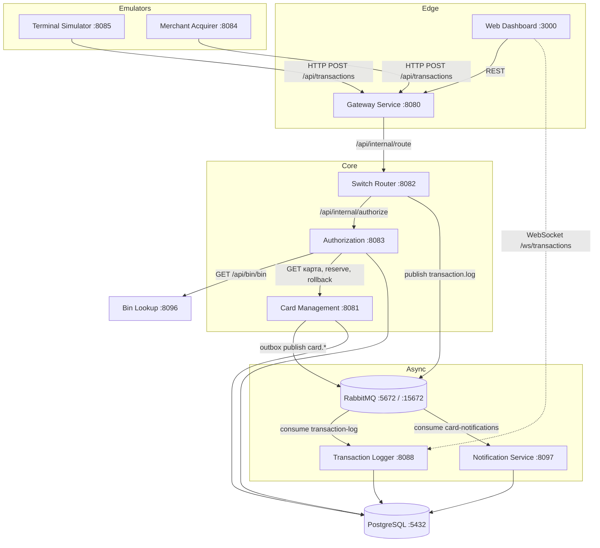
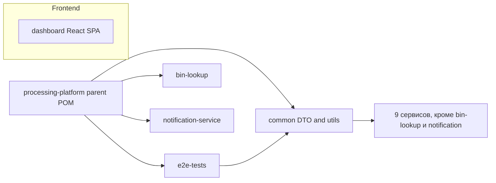
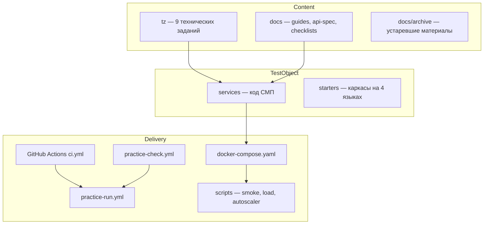

# Архитектура

> Компоненты, границы, направление зависимостей и структура репозитория.
> **Обновлять при изменении:** `services/`, `docker-compose.yaml`, `docs/architecture.md`

## Обзор

Проект имеет два уровня архитектуры:

1. **Runtime СМП** — 10 сервисных контейнеров + PostgreSQL + RabbitMQ, гибрид
   синхронного HTTP и асинхронного RabbitMQ (`docs/architecture.md`).
2. **Репозиторий-практикум** — слои контента (ТЗ, docs, CI, scripts, starters),
   которые обрамляют объект тестирования и задают пайплайн сдачи.

## Runtime: зависимости

Вербально: эмуляторы терминалов и мерчантов шлют авторизационный запрос на Gateway;
Gateway проксирует его в Switch, который маршрутизирует по BIN в Authorization.
Authorization обогащает issuerId через Bin Lookup и работает с картой через Card
Management, затем Switch асинхронно публикует транзакцию в RabbitMQ для Transaction
Logger. Card Management через outbox-паттерн публикует карточные события в
Notification Service. Дашборд читает агрегаты через Gateway и подписан на WebSocket
Transaction Logger. В БД напрямую пишут четыре сервиса — Card Management,
Authorization, Transaction Logger и Notification Service (см. Q4 в
[00_OPEN_QUESTIONS.md](00_OPEN_QUESTIONS.md) про merchant-acquirer).

## Runtime: ответственности

| Компонент | Порт | Ответственность | Взаимодействие |
|---|:---:|---|---|
| Gateway | 8080 | единая точка входа, маршрутизация, rate limit, circuit breaker, graceful shutdown, маскирование логов | sync HTTP |
| Card Management | 8081 | CRUD карт, генерация тестовых карт, Luhn, резервирование/rollback, outbox событий | sync HTTP + RabbitMQ producer |
| Switch / Router | 8082 | маршрутизация по BIN, вызов Authorization, публикация транзакций в Logger | sync HTTP + RabbitMQ producer |
| Authorization | 8083 | решение APPROVED/DECLINED, проверка статуса/срока/лимитов/баланса, RRN/authCode, reversal | sync HTTP |
| Bin Lookup | 8096 | внешний API обогащения по BIN | sync HTTP |
| Terminal Simulator | 8085 | эмуляция POS-терминалов и сценариев | HTTP к Gateway |
| Merchant Acquirer | 8084 | эмуляция мерчантов/эквайрера, MCC, комиссия | HTTP к Gateway + БД |
| Transaction Logger | 8088 | приём/поиск транзакций, статистика, WebSocket | RabbitMQ consumer + БД |
| Notification Service | 8097 | приём карточных событий, хранение уведомлений | RabbitMQ consumer + БД |
| Web Dashboard | 3000 | React SPA: KPI, графики, таблица, карта, экспорт CSV | REST + WebSocket |
| PostgreSQL | 5432 | общая БД `smp_db`, Flyway-миграции по сервисам | JDBC |
| RabbitMQ | 5672/15672 | асинхронный брокер, DLX/DLQ, publisher confirms | AMQP |

## Модульные зависимости

Вербально: родительский POM `services/pom.xml` управляет версиями и профилями.
Модуль `common` содержит общие DTO и аннотации валидации и подключён к 9 сервисам;
bin-lookup и notification-service не зависят от `common`
(проверено по `<artifactId>common</artifactId>` в pom). `dashboard` — отдельный
npm-проект, не входящий в Maven-реактор.

## Репозиторий-практикум: слои

Вербально: контентная часть (`tz`, `docs`) описывает требования к объекту
тестирования (`services`, `starters`); доставка и проверка практик идут через три
workflow и скрипты поверх `docker-compose.yaml`.

## Границы и конвенции

- Пакеты Java: `com.processing.<service>`, тесты — `com.processing.<service>` или
  `com.processing.e2e`.
- Dockerfile сервисов — multi-stage: `maven:3.9.16-eclipse-temurin-21-alpine` ->
  `eclipse-temurin:21-jre-alpine` (`services/gateway/Dockerfile`).
- Стиль Java контролируется `services/checkstyle.xml` через checkstyle
  fail on violation.

## Связи

- Потоки: [03_DATA_FLOW.md](03_DATA_FLOW.md); модули: [06_MODULES.md](06_MODULES.md);
  домен: [07_DOMAIN_MODEL.md](07_DOMAIN_MODEL.md); эксплуатация: [11_OPERATIONS.md](11_OPERATIONS.md).
