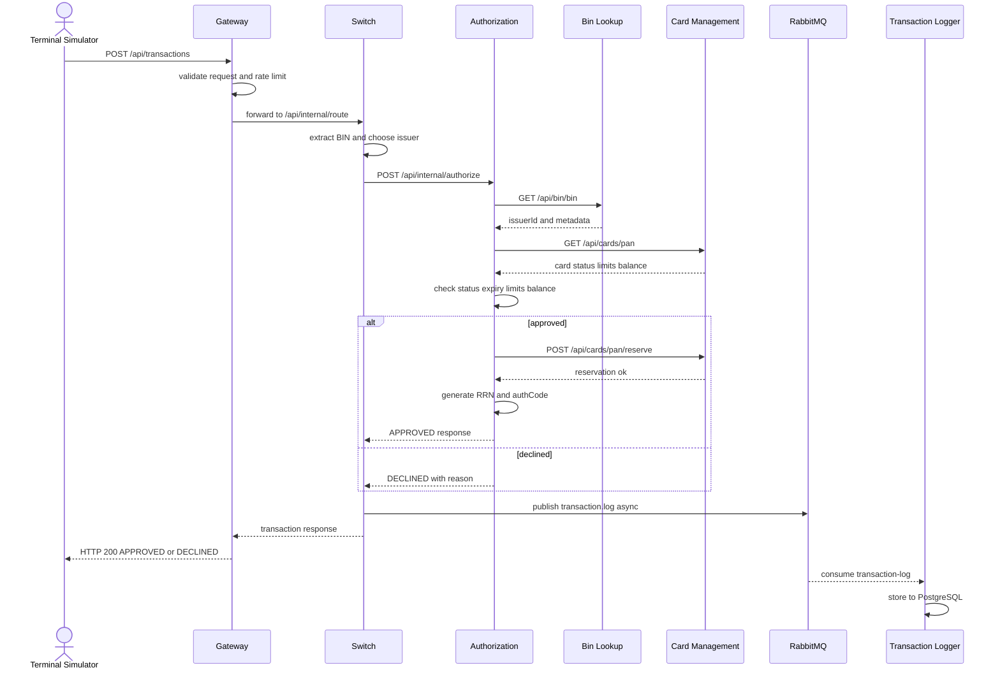
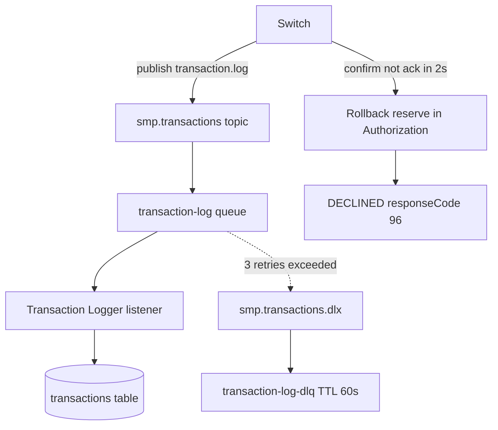
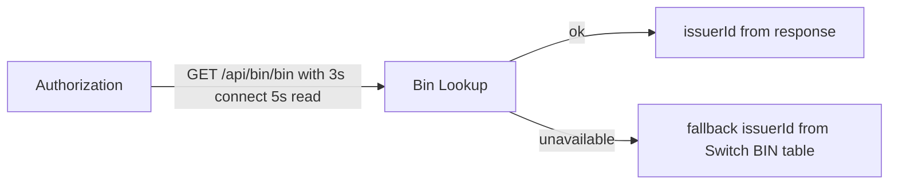
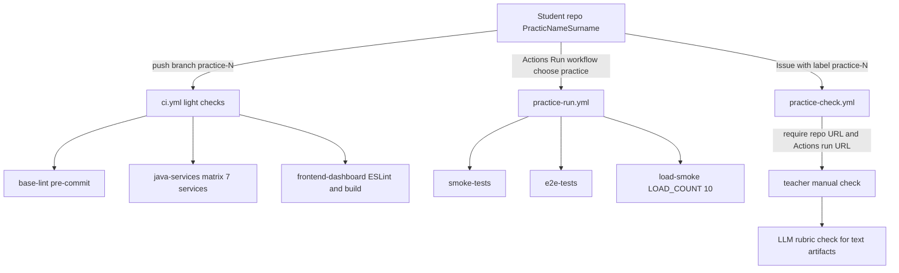

# Потоки данных

> Конвейеры данных: авторизация транзакции, асинхронное логирование, карточные
> события и пайплайн сдачи практик.
> **Обновлять при изменении:** `services/`, `docker-compose.yaml`, `.github/workflows/`

## Обзор

Основной поток — сквозной путь карточной транзакции: эмулятор -> Gateway -> Switch
-> Authorization -> Card Management -> ответ, с параллельным асинхронным
логированием. Отдельно идут карточные события через outbox и пайплайн сдачи работ.
Ниже — по одной Mermaid-диаграмме на сценарий и вербальное описание.

## Сценарий 1 — Авторизация покупки (синхронный)



Вербально: Gateway валидирует и ограничивает частоту, затем проксирует запрос в
Switch (`RewritePath=/api/transactions -> /api/internal/route`,
`services/gateway/src/main/resources/application.yml:64-73`). Switch извлекает BIN и
маршрутизирует в Authorization. Authorization обогащает issuerId через Bin Lookup,
читает карту через Card Management и проверяет статус, срок действия, лимиты и
баланс. При успехе выполняется резервирование средств; ответ идёт обратно по цепочке.
Параллельно Switch публикует транзакцию в RabbitMQ — запись в лог приходит не
мгновенно, отсюда eventual consistency. Известное ограничение: резервирование
неатомарно между GET карты и POST reserve (`docs/architecture.md:104`).

## Сценарий 2 — Асинхронное логирование и откат при недоступности RabbitMQ



Вербально: Switch использует `RabbitTemplate` с publisher confirms типа CORRELATED.
Если брокер не подтверждает публикацию за 2 секунды, Switch откатывает
резервирование через reversal `mti=0400` и отвечает `DECLINED` с
`responseCode=96` (`docs/architecture.md:230`, `services/switch/.../RouteService.java`).
Очереди настроены с DLX: до 3 retry, затем сообщение уходит в DLQ с TTL 60s.
Это гарантирует, что нет APPROVED-транзакции без записи в очереди.

## Сценарий 3 — Карточные события через Outbox

```mermaid
sequenceDiagram
    participant CMS as Card Management
    participant OB as outbox_event table
    participant PROC as OutboxEventProcessor
    participant RMQ as RabbitMQ
    participant NS as Notification Service
    participant DB as card_notifications

    CMS->>OB: save event PENDING in same transaction
    PROC->>OB: poll PENDING
    PROC->>RMQ: publish card.* to smp.card-events
    PROC->>OB: mark PROCESSED
    RMQ-->>NS: consume card-notifications
    NS->>DB: store notification
    RMQ-.->|retry exhausted| DLQ[card-notifications-dlq]
```

Вербально: Card Management сначала сохраняет событие в таблицу `outbox_event` в той
же транзакции, что и изменение карты, затем `OutboxEventProcessor` публикует
`PENDING`-события в topic-exchange `smp.card-events` с routing key `card.*` и
помечает их `PROCESSED`. Notification Service потребляет очередь
`card-notifications` и сохраняет уведомления. При недоступности RabbitMQ — retry с
exponential backoff, три попытки, затем статус `FAILED`
(`docs/architecture.md:236-247`).

## Сценарий 4 — Деградация Bin Lookup



Вербально: Authorization вызывает Bin Lookup синхронно через `RestClient` с
таймаутами 3s на connect и 5s на read. При недоступности используется graceful
degradation — fallback на issuerId из BIN-таблицы Switch
(`docs/architecture.md:232-234`).

## Сценарий 5 — Пайплайн сдачи практики



Вербально: студент работает в отдельном репозитории. Каждый push запускает лёгкий
`ci.yml` (pre-commit, checkstyle+сборка 7 Java-сервисов, ESLint+сборка дашборда).
Тяжёлые проверки — вручную через `practice-run.yml` с выбором номера практики
(1 = smoke, 5 = e2e, 6 = load-smoke). Сдача — через Issue в эталонном репозитории с
label `practice-N`; `practice-check.yml` валидирует наличие ссылок на репозиторий и
Actions run, а вердикт по CI и LLM-рубрике ставит преподаватель
(`docs/submission-guide.md:7-27,58-108`).

## Потоки данных в БД

| Таблица | Пишет | Читает | Источник миграции |
|---|---|---|---|
| `cards`, `bin_issuers`, `reservations`, `reservations_rollbacks`, `outbox_events` | Card Management | Card Management | `V5.1..V5.8` |
| `limit_usage` | Authorization | Authorization | `V3.1` |
| `transactions` | Transaction Logger | Transaction Logger | `V1..V2` |
| `card_notifications` | Notification Service | Notification Service | `V1` |
| `merchants`, `terminals`, `acquirer_fee` | Merchant Acquirer | Merchant Acquirer | `V71..V74` |

## Связи

- Архитектура и границы: [02_ARCHITECTURE.md](02_ARCHITECTURE.md);
  API и CLI: [04_ENTRYPOINTS.md](04_ENTRYPOINTS.md); домен: [07_DOMAIN_MODEL.md](07_DOMAIN_MODEL.md).
- Нестыковки по БД: [00_OPEN_QUESTIONS.md](00_OPEN_QUESTIONS.md) Q4–Q6.
