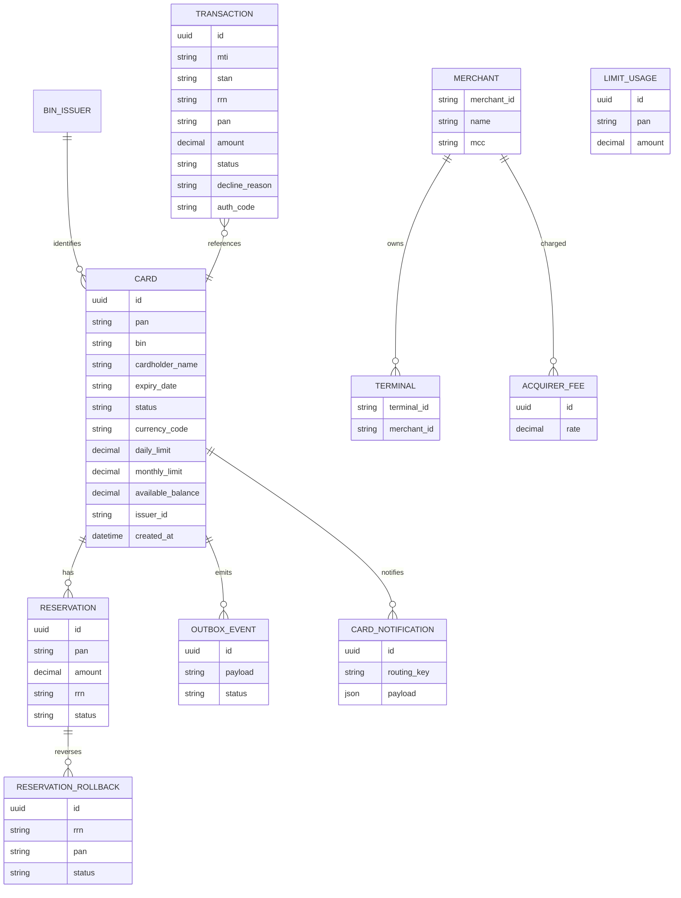

# Доменная модель

> Сущности процессинга, их поля и связи; маппинг на упрощённый ISO 8583.
> **Обновлять при изменении:** `services/`, `docs/api-spec.md`, `docs/architecture.md`

## Обзор

Домен — карточный процессинг: карты, лимиты, резервирования, транзакции,
карточные уведомления, мерчанты и эквайринг. Модель физически распределена по
таблицам одной БД, но логически изолирована: сервисы не читают чужие таблицы
напрямую, а ходят через API или RabbitMQ (`docs/architecture.md:212-220`).

## Диаграмма сущностей

Вербально: `BIN_ISSUER` определяет принадлежность карты эмитенту; карта имеет
резервирования и их откаты; карточные события публикуются через `OUTBOX_EVENT` и
попадают потребителю как `CARD_NOTIFICATION`; мерчанты владеют терминалами и
тарифицируются через `ACQUIRER_FEE`; транзакция ссылается на карту по PAN.
`LIMIT_USAGE` ведёт Authorization для учёта использованных лимитов.

## Ключевые сущности

| Сущность | Источник | Поля и заметки |
|---|---|---|
| Card | `docs/architecture.md:111-126`, `docs/api-spec.md:272-287` | `pan` 16 цифр, `bin` 6, `expiryDate` MMYY, статус ACTIVE/INACTIVE/BLOCKED/EXPIRED, лимиты и баланс в минорных единицах, `issuerId` |
| Transaction | `docs/architecture.md:128-149`, `docs/api-spec.md:320-329` | `mti` 0100/0110, `stan` 6, `rrn` 12, `pan`, `processingCode` 000000 = покупка, `amount`, `mcc`, `acquirerId`, `issuerId`, `status`, `declineReason`, `authCode`, `transmissionDateTime` |
| Reservation | `V5.3__init_reservations_table.sql`, `ReserveRequest` | резерв суммы под авторизацию; rollback отменяет |
| ReservationRollback | `V5.4__init_reservations_rollbacks_table.sql`, `RollbackRequest` | reversal `mti=0400` при сбое логирования |
| OutboxEvent | `V5.5__init_outbox_events_table.sql`, `OutboxOptions` | статусы `PENDING`/`PROCESSED`/`FAILED`, retry с backoff |
| LimitUsage | `V3.1__create_rrn_seq.sql`, `LimitUsage` | учёт дневных/месячных лимитов, sequence для RRN |
| CardNotification | `V1__create_notifications_table.sql`, `CardNotification` | JSON-payload + routing key события |
| Merchant / Terminal / AcquirerFee | `V71..V74`, `domain/entity/*` | база мерчантов, терминалы, ставка комиссии |
| BinIssuer | `V5.2__init_bin_issuers_table.sql`, `BinIssuer` | справочник BIN -> issuerId |

## Маппинг на ISO 8583

ISO 8583 упрощён до JSON (`docs/architecture.md:153-188`):

- `mti`: `0100` — запрос авторизации, `0110` — ответ, `0400` — reversal.
- `processingCode`: `000000` — покупка.
- Ключевые поля: PAN, STAN, RRN, amount, currencyCode, terminalId, merchantId, MCC,
  acquirerId, issuerId.

## Коды ответа

| Код | Значение |
|:---:|---|
| `00` | Approved |
| `05` | Do Not Honor |
| `12` | Invalid Transaction |
| `14` | Invalid Card Number |
| `30` | Format Error |
| `41` | Lost Card |
| `43` | Stolen Card |
| `51` | Insufficient Funds |
| `54` | Expired Card |
| `61` | Exceeds Amount Limit |
| `96` | System Error (публикация в RabbitMQ не подтверждена) |

Источник: `docs/api-spec.md:331-344`; код `96` — из
`docs/architecture.md:230` и `services/switch/.../RouteService.java`.

## Статусы и сценарии

- Статусы карты: ACTIVE, INACTIVE, BLOCKED, EXPIRED (`CardModelStatus`).
- Причины decline в Authorization: статус карты, истёкший срок, недостаток средств,
  превышение лимитов, отсутствие карты, недоступность сервиса, дубликат и т.д.
  (`services/authorization/.../events/AuthService*Event.java`).
- Статусы симулятора: `normal`, `mixed`, `high_value`, `night_time`,
  `declines_test` (`docs/api-spec.md:186`); стратегии терминала:
  AlmostDailyLimit, Blocked, HighValue, InvalidPan, MoreThanDailyLimit, NoMoney,
  Normal (`services/terminal-simulator/.../strategy/`).

## Связи

- Потоки: [03_DATA_FLOW.md](03_DATA_FLOW.md); модули: [06_MODULES.md](06_MODULES.md);
  термины: [12_GLOSSARY.md](12_GLOSSARY.md).
